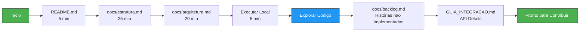
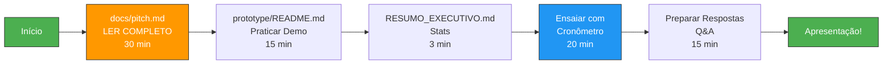
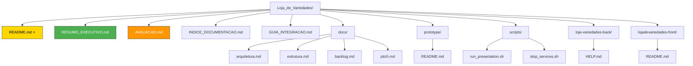
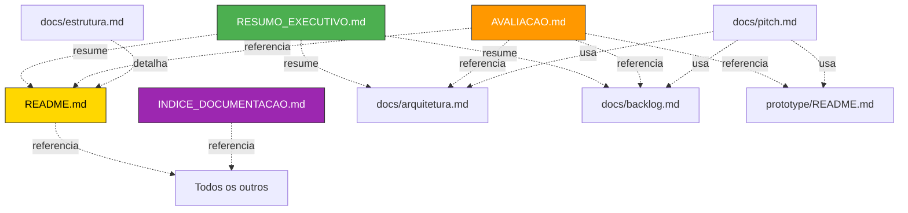
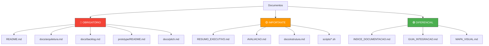
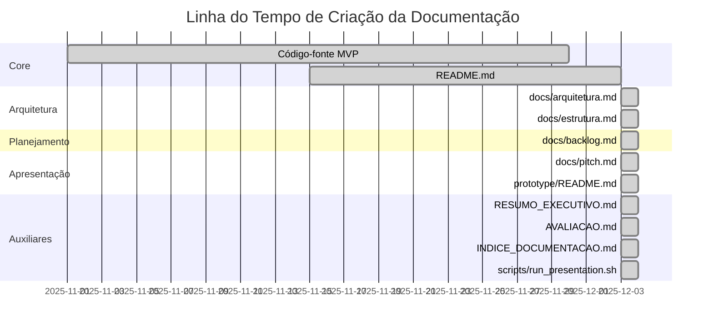
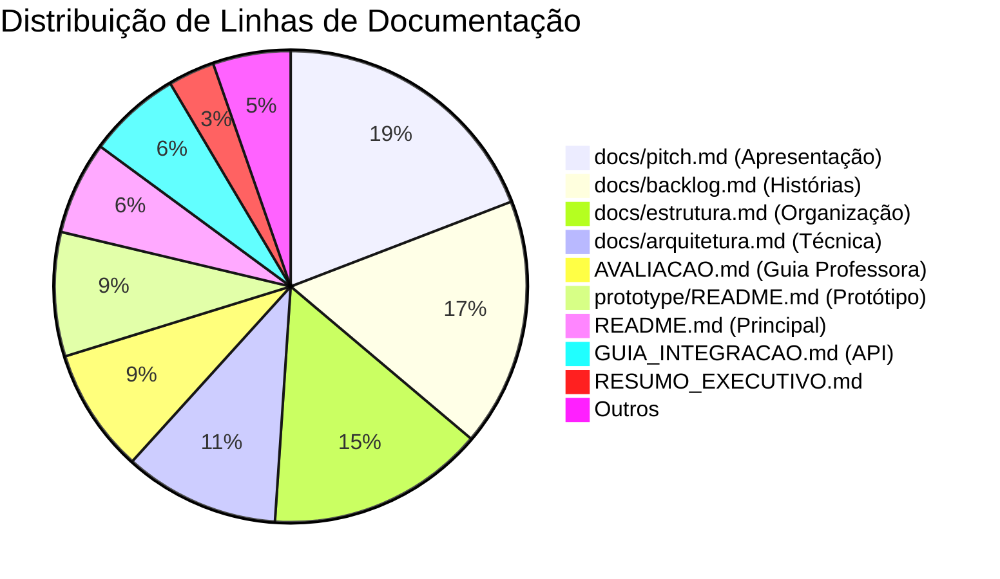

# 🗺️ Mapa Visual da Documentação

Este documento contém diagramas visuais da estrutura de documentação do projeto.

## 📊 Estrutura Geral de Documentação

```mermaid
graph TD
    A[README.md<br/>Início] --> B[RESUMO_EXECUTIVO.md<br/>Visão Rápida]
    A --> C[AVALIACAO.md<br/>Guia Professora]
    A --> D[INDICE_DOCUMENTACAO.md<br/>Navegação Completa]
    
    A --> E[/docs/]
    E --> E1[arquitetura.md<br/>Decisões Técnicas]
    E --> E2[estrutura.md<br/>Organização]
    E --> E3[backlog.md<br/>Épicos & Histórias]
    E --> E4[pitch.md<br/>Apresentação]
    
    A --> F[/prototype/<br/>README.md]
    F --> F1[Cenários de Teste]
    F --> F2[Credenciais]
    
    A --> G[GUIA_INTEGRACAO.md<br/>API Docs]
    
    A --> H[/scripts/]
    H --> H1[run_presentation.sh]
    H --> H2[stop_services.sh]
    
    style A fill:#4CAF50,stroke:#333,color:#fff
    style B fill:#2196F3,stroke:#333,color:#fff
    style C fill:#FF9800,stroke:#333,color:#fff
    style D fill:#9C27B0,stroke:#333,color:#fff
```

## 🎯 Fluxo de Leitura por Persona

### 👨‍🎓 Fluxo da Professora (Avaliação)


### 👨‍💻 Fluxo do Desenvolvedor



### 🎤 Fluxo do Apresentador



## 📚 Hierarquia de Documentos



## 🔄 Dependências entre Documentos



## 📊 Cobertura de Requisitos do Projeto Final

```mermaid
graph LR
    PF[Projeto Final] --> R1[Item 1: Repositório]
    PF --> R2[Item 2: Apresentação]
    
    R1 --> R1A[a. Código MVP]
    R1 --> R1B[b. Protótipo]
    R1 --> R1C[c. Arquitetura]
    R1 --> R1D[d. Backlog]
    R1 --> R1E[e. README]
    
    R1A -.cumprido por.-> CODE[/src/ Backend+Frontend]
    R1B -.cumprido por.-> PROTO[/prototype/README.md]
    R1C -.cumprido por.-> ARQ[/docs/arquitetura.md]
    R1D -.cumprido por.-> BACK[/docs/backlog.md]
    R1E -.cumprido por.-> README[/README.md]
    
    R2 --> R2A[10min apresentação]
    R2 --> R2B[5min Q&A]
    
    R2A -.cumprido por.-> PITCH[/docs/pitch.md]
    R2B -.cumprido por.-> QA[pitch.md seção Q&A]
    
    style CODE fill:#4CAF50,stroke:#333,color:#fff
    style PROTO fill:#4CAF50,stroke:#333,color:#fff
    style ARQ fill:#4CAF50,stroke:#333,color:#fff
    style BACK fill:#4CAF50,stroke:#333,color:#fff
    style README fill:#4CAF50,stroke:#333,color:#fff
    style PITCH fill:#4CAF50,stroke:#333,color:#fff
    style QA fill:#4CAF50,stroke:#333,color:#fff
```

## 🎯 Prioridade de Leitura



## 📈 Evolução da Documentação



## 📦 Tamanho da Documentação



---

## 🔗 Links Rápidos

- [Voltar ao README Principal](./README.md)
- [Ver Índice Completo de Documentação](./INDICE_DOCUMENTACAO.md)
- [Resumo Executivo (1 página)](./RESUMO_EXECUTIVO.md)
- [Guia de Avaliação para Professora](./AVALIACAO.md)

---

**Nota:** Os diagramas acima são renderizados automaticamente pelo GitHub usando Mermaid. Se estiver visualizando em outro lugar, pode ser necessário um plugin ou ferramenta compatível.

---

**UFERSA | Engenharia de Software | Prof.ª Huliane Medeiros | 2025.2**
